# Polaris 导航软件

本项目为一个主体上基于PyQt5/PyQt-Fluent-Widgets的导航软件，使用OpenStreetMap(osm)上的真实地球道路信息，以Polaris北极星作为名字和图标代表导航功能。图标来源于阿里矢量图标库。

本项目基于C/C++, Python, Rust, HTML, JS，CSS等多种语言，实现了一个完整的导航软件，包括前端界面、后端算法、渲染器等多个部分。

## 基本功能

### 项目结构

本项目结构如下图所示：

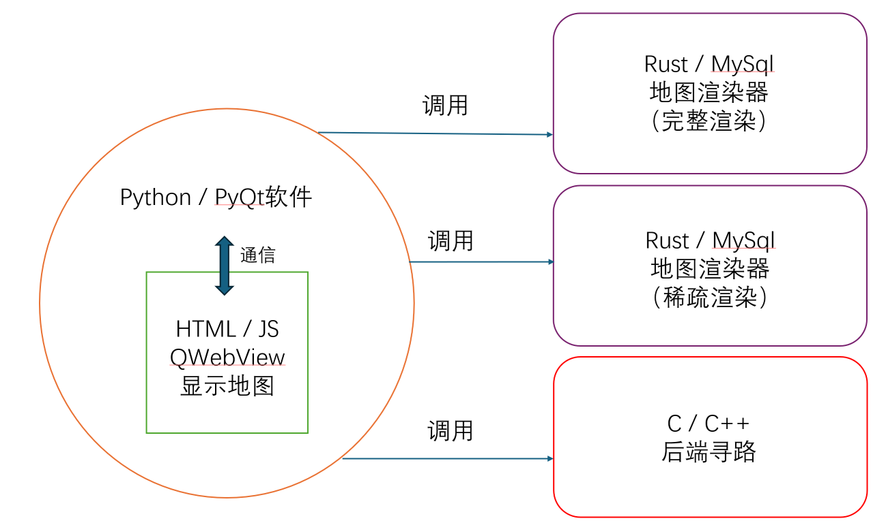
其中：

1. Python前端使用PyQt-Fluent-Widgets框架, 实现win11风格软件
2. Python前端调用：浏览器内核 + 后端exe + 渲染器exe
3. C/C++后端与Rust渲染器的调用方法：由python解释器开启子进程
4. 信息接收与发送方式：stdin, stdout

以下为Python前端主体的文件框架：

```
root
│  deploy.py                (Nuikta deploy script)
│  main.pro                 (Qt project file)
│  main.py                  (Entry script)
│  requirements.txt         (Dependency file)
│
└─app
    ├─common
    │      config.py        (Configuration file)
    │      icon.py          (Custom fluent icon)
    │      resource.py      (Resource file, generated by resource.qrc)
    │      setting.py       (Constant file)
    │      signal_bus.py    (Signal bus)
    │      style_sheet.py   (Custom style sheet)
    │
    ├─resource              (Resource folder)
    │  │  resource.qrc
    │  │
    │  ├─i18n               (Translation files)
    │  │      app.zh_CN.qm
    │  │      app.zh_CN.ts
    │  │      app.zh_HK.qm
    │  │      app.zh_HK.ts
    │  │
    │  ├─images
    │  │  │  logo.ico
    │  │  │  logo.png
    │  │  │
    │  │  └─icons
    │  │          SettingsFilled_black.svg
    │  │          SettingsFilled_white.svg
    │  │          Settings_black.svg
    │  │          Settings_white.svg
    │  │
    │  └─qss
    │      ├─dark                           (qss files in dark theme mode)
    │      │      setting_interface.qss
    │      │
    │      └─light                          (qss files in light theme mode)
    │              setting_interface.qss
    │
    └─view                                  (Interfaces)
            main_window.py
            setting_interface.py
            info_interface.py               (Display information and logs)
            map_interface.py                (The main functioning interface containing map, interactions and so on)
```

### APP页面介绍/各页面功能

软件界面一共有三个Interface: `setting_interface`, `info_interface`, `map_interface`, 分别显示设置, 信息, 地图界面。

#### 地图界面

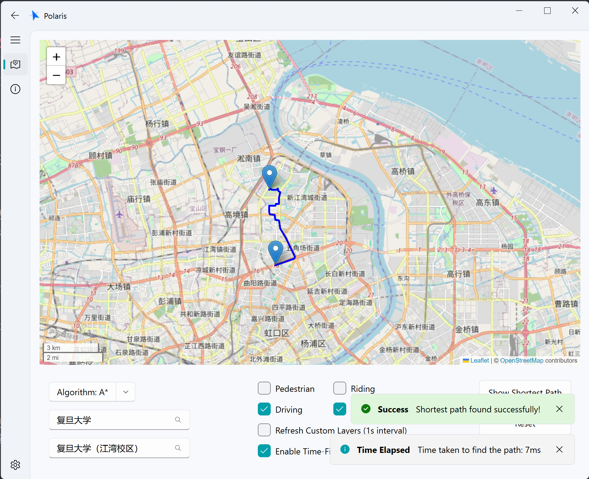
地图界面包含以下部分：

1. 浏览器显示地图(QWebEngineView, QWebChannel）)
2. 地图上的控件(PushButton, TickBox, LineEdit, SplitPushButton)，用于交互：输入起点终点，选择算法，选择模式，设置选择通行限制，选择速度优先模式等
3. 后端地图加载进度条：显示地图加载进度

其中LineEdit查询起始点与终点地名，自动提供suggestions的实现方法：
1. 后端在读完数据后对地名进行去重，然后生成一份txt文件（若已存在就不会生成了），每行包括一个地点名和对应的经纬度
2. 前端Python读取txt，装载到LineEdit的选项里
3. 点击搜索按钮，把对应的点加到地图上

#### 信息界面

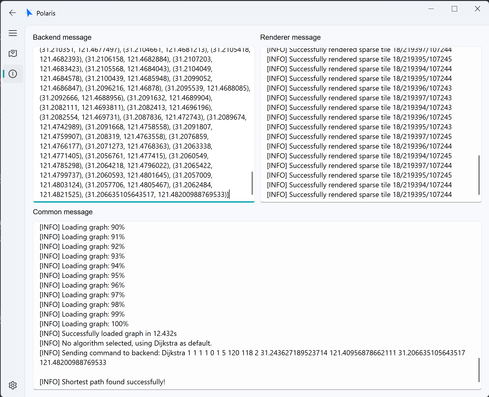
该页面显示前后端和渲染器的运行时信息，将日志信息显示在界面上，方便用户查看。

#### 设置界面

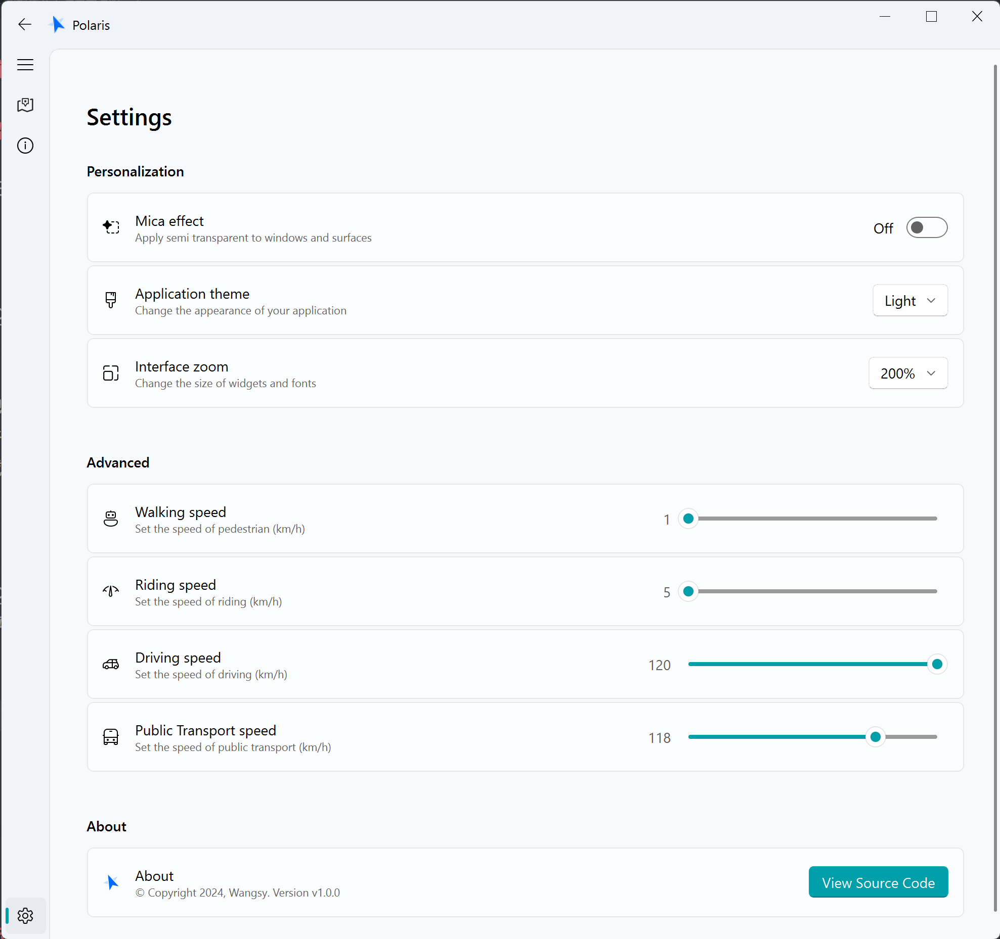
该页面显示软件的设置，包括：

1. 画面设置（深色/浅色模式，Mica效果，界面缩放大小）
2. 高级设置（速度优先模式中各交通方式的速度）
3. 关于（软件版本，开发者信息）

### 后端结构

后端主要由C/C++编写，主要功能是读取地图数据，进行寻路计算，然后将结果返回给前端。主要实现大体如下：

1. Kd树存储地图数据，方便查询最近点等
2. 用哈希表和一些数组辅助存储数据，提高速度 (indexing)
3. 通过stdin stdout与python程序交流
4. stdin：查询格式, eg. `Dijkstra 1 1 1 1 0 1 5 120 118 2 31.243627189523714 121.40956878662111 31.206635105643517 121.48200988769533`
5. stdout：输出为一堆经纬度的元组。
6. 目前的地图：整个上海

共分为如下几个文件：

```
├── main.cpp (8.99KB)           (主函数)
├── k-dtree.cpp (9.64KB)        (Kd树实现)
├── path_finding.cpp (36.25KB)  (寻路算法实现)
├── defs.h (7b)                 (常量定义)
├── k-dtree.h (4.27KB)          (Kd树头文件)
├── path_finding.h (4.09KB)     (寻路算法头文件)
```

## 额外功能

### 支持任意选点

地图上可以任意选点，鼠标左键在地图上点击即可。前端将用户任意选择的点的经纬度发给后端，后端用KD树找到离这个点最近的路径类节点，这也是使用KD树这一数据结构的一个重要原因。

这一想法有一个问题：离用户选的点的最近的路径类节点所连成的路径不一定是最短路径。目前未找到除暴力尝试外的更好的解决方案。

### 渲染器的实现

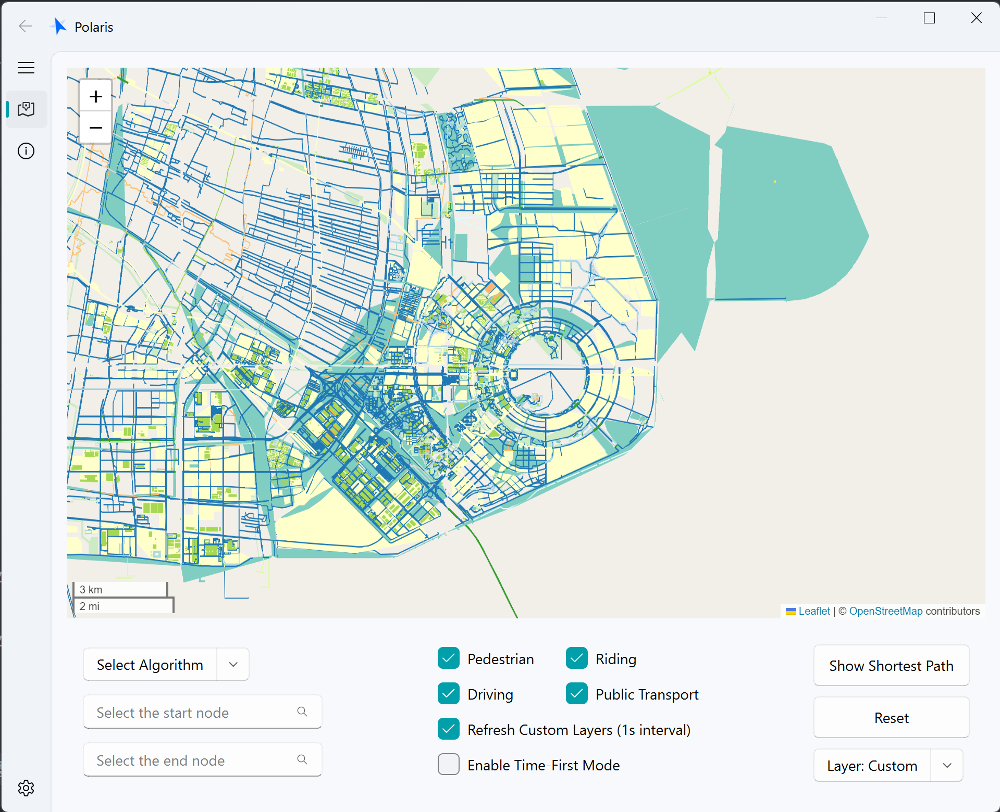
渲染器使用Rust编写，因为性能优势 + 调库方便(Cargo╰(*°▽°*)╯)

我们先使用Python脚本调用sql，预处理osm上直接下载的地图文件，生成地图的数据库版本，提前做好索引，然后用Rust调用这个数据库，进行渲染。

具体实现上，rust脚本会以tile(瓦片)为单位渲染，查询数据库获得一个tile内的所有信息，使用plotter库渲染并保存为png文件。

与前端的交互流程为：前端调用渲染器->渲染器完成任务生成png文件->前端地图刷新，显示出png文件。

此外，放大到一定程度后还会显示地名：
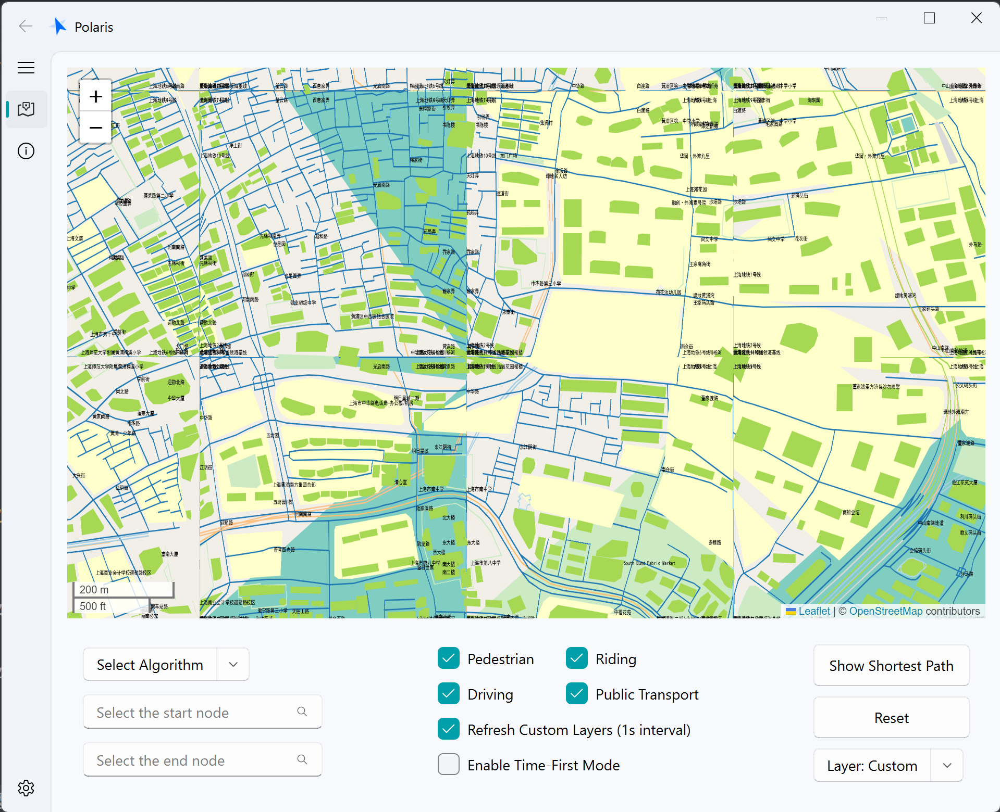

#### 渲染模式

渲染器实现了稀疏和非稀疏两种渲染模式：非稀疏模式会渲染一张瓦片图里的所有信息，而稀疏模式会根据地图的缩放程度，
有选择性地渲染一部分道路信息，这样是更加符合真实地图的应用场景的。

以下是同一个场景下的两种渲染模式的对比：
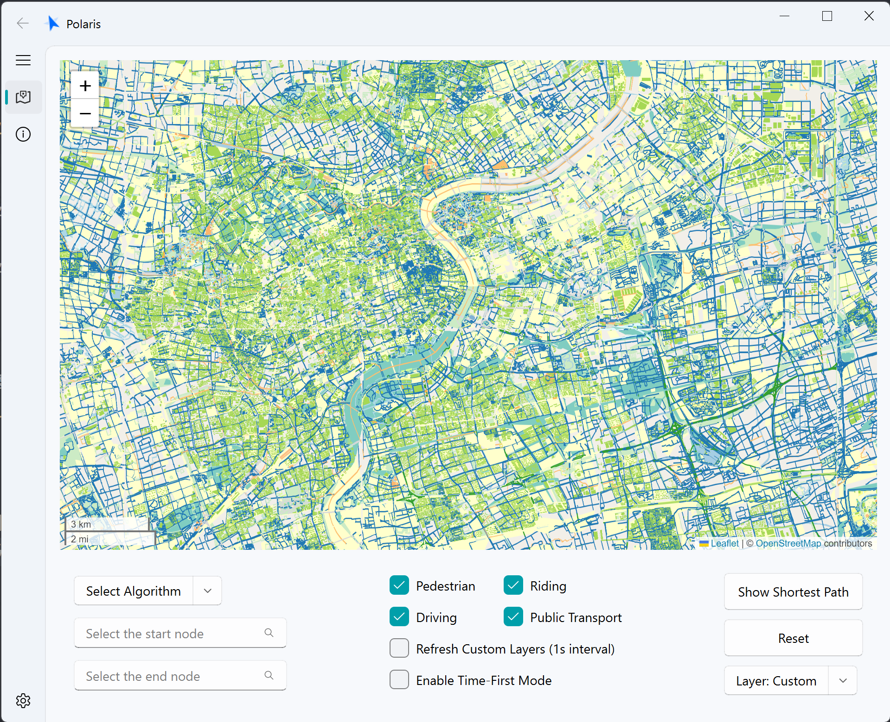
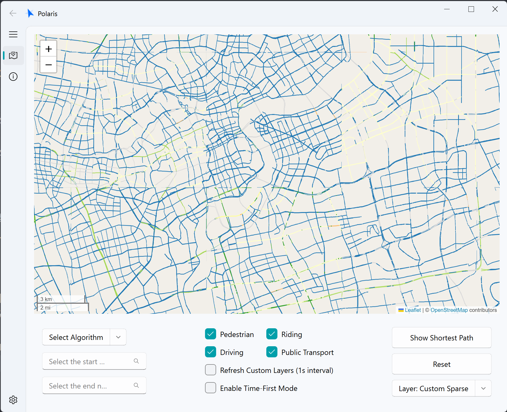

#### 渲染器的性能

通过Sql语句的优化+数据库的indexing，渲染器的性能已经极高，平均一张瓦片图耗时50ms：
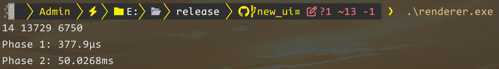

这样高的性能也使得前端可以实时渲染地图(每张瓦片图都调用一个renderer.exe来渲染)，让用户体验更好。

#### 保证正确的图形颜色填充：

由于osm数据在读取后内存中排列不一定是按照相对地理位置的正确顺序，所以在渲染时需要保证正确的颜色填充。以下是一个错误场景：


目前的解决方法是使用凸包算法(Convex Hull)来保证正确的颜色填充。然而这一方法有个问题，一些建筑物本来就是凹多边形，这样的建筑物会被填充为凸多边形，这样并不完美，但能够提供良好的视觉体验，所以仍采用这一方案。

#### 存在的问题

理论上，渲染一张瓦片图所需的数据不仅仅是其范围内的所有信息，还需要其周围的信息，以保证瓦片图的边缘不会出现断裂，且正确渲染瓦片图内的所有道路等。鉴于osm数据组织的方式，真正完美的渲染需要同时读取整个地球的信息，然后一次性将所有瓦片图生成。受限于硬件和时间，我们无法实现这一点。

### 多个寻路算法

目前支持的寻路算法有：

1. Dijkstra
2. 双向A*
3. Bellman-Ford(并不完全符合场景，但还是实现了一份可用的版本)

在速度方面，双向A* > Dijkstra >> Bellman-Ford，
双向A*的速度远快于Dijkstra，为理想的寻路算法。

此外，各算法的寻路效果均一致，互相映证了找到的最短路的正确性。

### 支持加中间点

支持用户在起点和终点之间加入任意个中间点，这样可以更加精确地规划路线。

加中间点的方法是按住Ctrl键点击地图，加入的中间点用黄色节点表示。

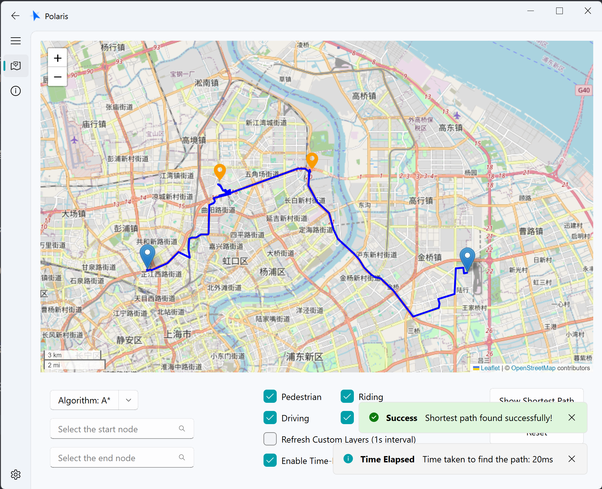
以下是支持中间点的寻路的实现细节：

1. 找到离起点最近的中间点
2. 从这个中间点开始，找到离它最近的中间点
3. 重复2直到中间点均被选出，此时我们获得了一个从起点到终点依次要访问的中间点序列
4. 调用点对点的寻路算法，将中间点序列中的相邻两点作为起点和终点，得到一系列的路径
5. 将这些路径拼接起来，得到最终的路径

也就是说，我们视中间点为无序的，如果包含起点和终点在内一共有$n$个点，我们调用寻路算法$n-1$次即可。

### 道路通行限制

支持用户选择不同的交通方式，如汽车、自行车、步行和公共交通。可以勾选不同的交通方式，以便更好地规划路线。

以下是同一起点终点的不同交通方式的路径规划：
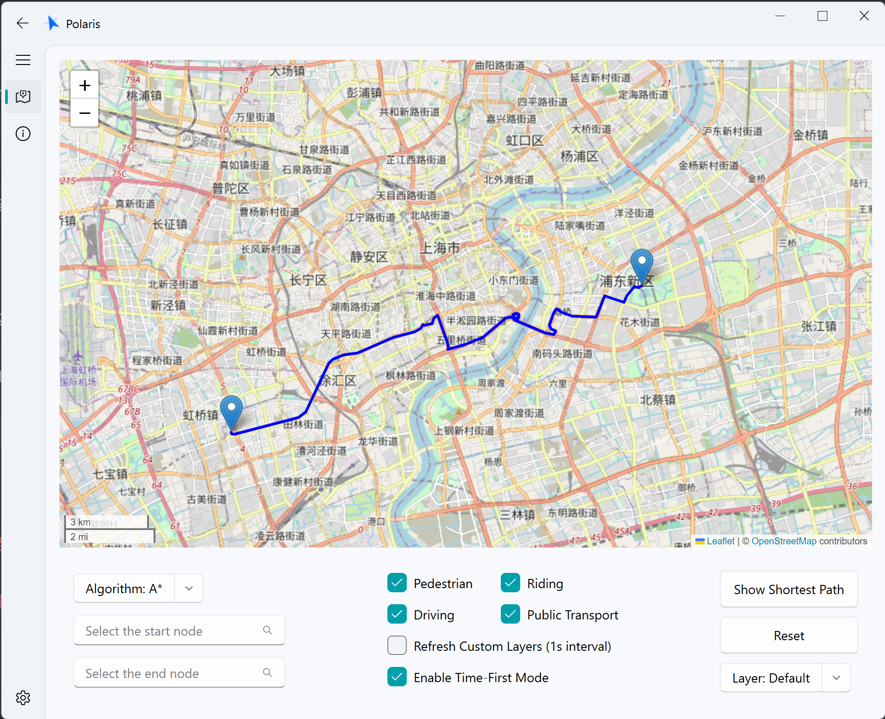
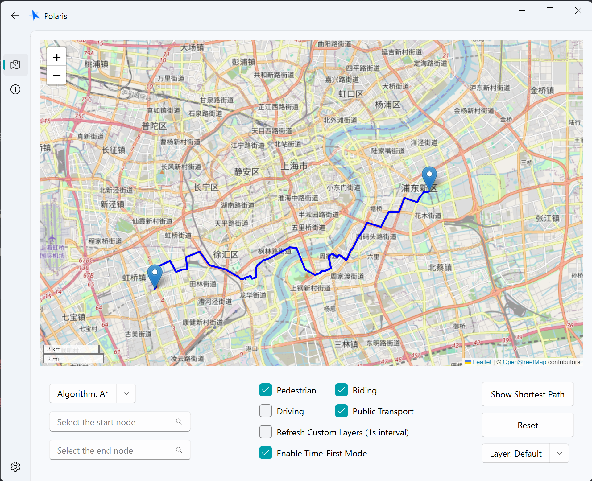

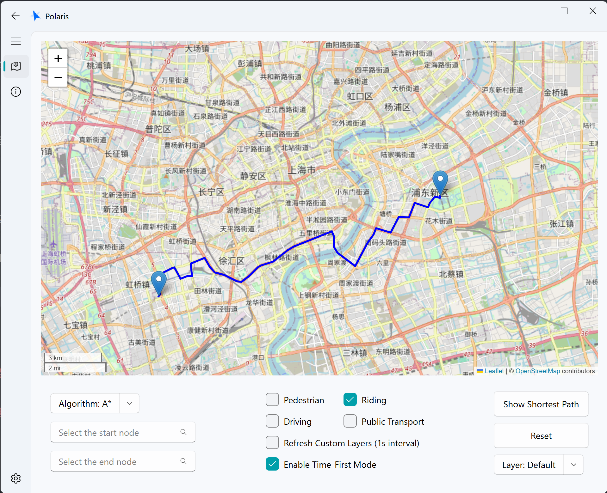

#### 实现方法

给每个交通方式分配一个道路类型白名单，只有在白名单内的道路才会被考虑。我们只需要在寻路算法中加入一个判断，判断当前道路是否在白名单内即可。

### 速度优先模式

在这一模式下，我们将“最短路径”定义为所需时间最短。用户可以选择不同的交通方式，以及不同的速度，以便更好地规划路线，确保能最快从起点到达终点。

以下是速度优先模式下的路径规划：
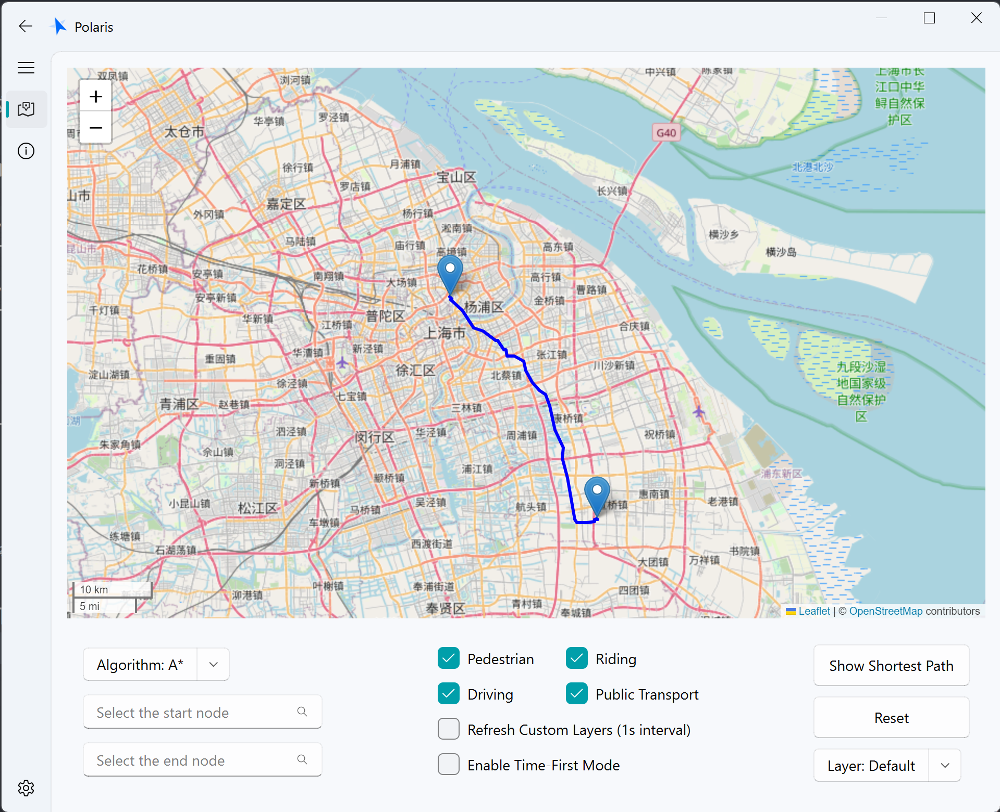
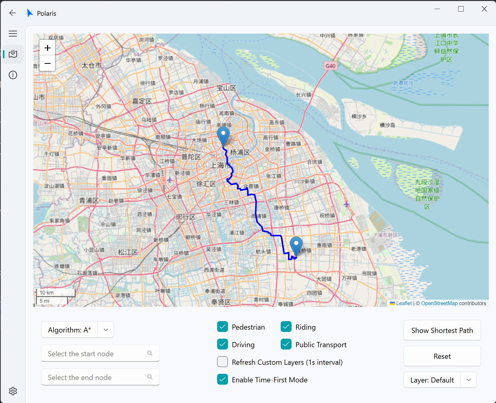

#### 实现方法

1. 为每种交通方式分配一个速度，单位为km/h，用户可以在设置界面内修改
2. 在寻路算法中，每条路查询其上能够行驶的最快交通方式，然后将路的距离除以这个交通方式的速度，得到新的权重
3. 用新的权重代替原来的权重，再进行寻路

### 适配大地图的寻路

#### 前端改进

一开始使用PyQt5的canvas直接绘制地图，这对于一个几百MB的小地图来说可行，但是对>1GB的大地图完全不可行：
因为在拖动canvas时，所有线条的位置均要被计算，这样会导致卡顿到不可接受的地步，内存占用也太高。

因此，使用Leaflet.js这一javascript库作为地图显示的工具，这样可以大大减少内存占用，提高用户体验。

#### 后端改进

处理地图xml文件时，需要选择一个性能较好的xml处理库：Tinyxml处理时内存占用过大，处理1GB的地图时内存占用峰值会达到~12GB，这是不可接受的。

因此，经过综合考虑后，使用了Pugixml这一xml处理库，内存占用大大减少，处理1GB的地图时内存占用峰值只有~5GB。

### 寻路准确性的提高

如果起点和终点相距很远，那么朴素的欧几里得距离就会产生显著偏差，我们需要使用弧线距离(Haversine Distance)来代替欧几里得距离。

这一算法基于地球的半径以经纬度计算两点之间的弧线距离，更改后，相同起始点和终点会产出与之前欧几里得距离不同的最短路径，显然弧线距离对应的路径更加准确。

### 算法速度的提高

在后端的实现中，我们使用一个vector存储所有node的经纬度，然而在寻路算法等地方我们需要频繁查询某一个node的id和tag，于是我们使用`index_to_node_id`，`index_to_tag`等哈希map加速节点信息的查询。

此外，我们给双向A*选取恰当的启发函数（也即Haversine Distance，弧线距离），使得其速度显著提高——一次常规的寻路耗时约10~20ms。

### 内存数据的序列化与反序列化

在后端的实现中，我们可以只读取/处理一次地图数据，然后将处理好的数据序列化保存，下次启动时直接反序列化；我们期望这样可以大大减少启动时间。

使用`boost::serialization`库，普通的哈希表直接序列化保存，而对于Kd树，我们需要自己实现序列化和反序列化的方法——将其每一个成员变量序列化，并且在处理节点时递归操作。

目前确实已成功实现，然而反序列化的时间和直接读取地图数据的时间相差不大，这是因为Kd树的构建时间远大于读取地图数据的时间，后续会继续进行优化。

## 使用说明

### 环境要求

1. Python环境
2. Rust工具链
3. C/C++工具链，编译环境
4. CMake

### 依赖与编译

#### Python依赖安装

在根目录下输入 `pip3 install -r requirements.txt`。

#### 渲染器编译——Rust

根目录下输入：

```bash
cd renderer
cargo build --release

cd renderer_sparse
cargo build --release
```

#### 后端编译——C/C++

根目录下输入：

```bash
cd backend
mkdir build && cd build
cmake ..
make -j$(nproc)
```

### 运行

在根目录下输入 `python main.py` 即可。

## 总结

本项目历经一个多月的开发时间，总共完成了五十多个Commit，可谓工作量极大。

### 过程记录

实现这样一个项目，从前端到后端，从算法到渲染，从界面到性能，都有很多细节需要考虑，很多问题需要解决。在这个过程中遇到了极多问题，包括但不限于：

1. 前端功能的学习和实现
2. 前后端交互的通信格式
3. 后端结构的设计，算法的实现
4. 渲染器的实现，性能的优化
5. 大地图的适配——适配大地图之前的项目详见main分支；适配之后的项目，也就是项目的最终样貌，请见new_ui分支

这些只是大的方面上的问题，实际实现起来还遇到了数不清的脑溢血小问题。比如：渲染器渲染出一张图后前端不能自动加载出来，非要整个页面刷新一遍才行，这个问题至今还未完全解决。

欲知所有遇到的问题/实现的功能，详见Commit History。

### 代码行数统计

各语言的代码行数如下：(使用Tokei工具统计)

```
==========================================================
 Language    Files        Lines         Code     Comments
==========================================================
 C Header        3          224          174            8
 C++             3         1390         1078           96
 CMake           7          482          345           47
 CSS             2          637          471           36
 HTML           70        10164         9896           70
 Python         17         5322         4921          141
 Rust            2          905          745           34
 Shell           3          168          123            5
 TypeScript      2          300          300            0
----------------------------------------------------------
 Markdown        5          357            0          249
 |- BASH         2           12           11            0
 |- CMake        1            1            1            0
 (Total)                    370           12          249
==========================================================
 Total         117        19962        18065          686
==========================================================
```
